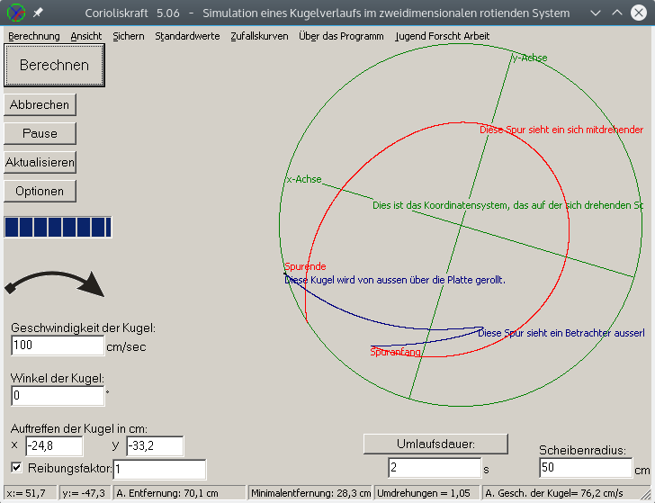

# Corioliskraft

Dies ist die Hilfe zu dem Simulationsprogramm der Corioliskraft.

Es simuliert eine rollende Kugel auf einer drehenden Scheibe. Dabei wird auch Rollreibung berücksichtigt. Es werden folgende Spuren dargestellt

* blau: Die Bahn der Kugel vom nicht-rotierenden Bezugssystem
* rot: Die Bahn der Kugel aus sicht des rotierenden Bezugssystems

Die Kugel kann dabei beliebige Anfangspositionen, Geschwindigkeiten, Rollreibungskoeffizienten haben. Außerdem kann der Scheibenradius konfiguriert werden.

## Screenshot 

## Die Hilfe:
#### Shortcuts
* F1	= Readme Datei aufrufen
* F9	= Berechnung ausführen
* P	= Pause anfang und Pause ende
* F11	= Zufallskurven berechnen
* ESC	= Stoppen
* S	= Speichert das Bild in eine Datei
* Strg+S	= Speichert die Einstellungen in eine Ini-Datei
* Strg+O	= Öffnet die Einstellungen aus einer ini-Datei
* i	= Öffnet das Informationsfenster
* a	= about, Öffnet die Information über das Programm
* v	= Versionsinfo anzeigen
* z	= erstellt Zufallswerte
* o	= Öffnet das Fenster mit den Optionen
* R	= Setzt die Kugel in umgekehrter Rollrichtung an den Rand
* Mausrad	= Bildzoomen  (Nur wenn das Häckchen bei Automatisch weg ist)
* Rechte Maustaste halten un ziehen	= Bild bewegen   (Nur wenn das Häckchen bei Automatisch weg ist)

#### Funktionen

* "Am Ende zurückdrehen"		= Dreht die Platte zurück bis der erste Punkt der Spur wieder an der Anfangsposition ist.
* Einstellungen --> Speichern	= Dort können sie die derzeitigen Einstellungen in einer ini-Datei speichern
* Einstellungen --> Öffnen	= Dort können sie die gespeicherten Einstellungen aus einer ini-Datei Öffnen
* Berechnung --> Spur zurückverfolgen	= setzt die Kugel in entgegengesetzter Roll-Richtung an den Scheibenrand.
* Berechnung --> Optionen --> Autoaktualisieren aus	= Dann wird allerdings das Plattenkoordinatensystem der Übersichtlichkeit halber nicht mitgedreht
* Berechnung --> Optionen --> Schrift = Zeigt Schriftzüge an dem Koordinatensysten und dem Spurenden
* Durch anklicken des gebogenen Pfeils kann man die Drehrichtung der Platte verändern.
* Durch anklicken der Überschrift "Umlaufsdauer" kann in die Winkelgeschwindigkeit gewechselt werden. Ebenso umgekehrt.

Unten in der Leiste steht manchmal Abkürzungen wie:

A.		= Aktuelle/r/s

Gesch.	= Geschwindigkeit

#### Farben

 * Die Rote gebogene Linie ist die Darstellung der Corioliskraft. So wie man die Flugbahn der Kugel sehen würde wenn man auf der Platte stünde, oder wenn man die Platte mit Mehl bestreuen und die Spur sehen würde.
 * Die Dunkelblaue Linie ist die Sicht von Aussen, wie die Kugel laufen würde.
 * Die grünen Linien sind ein Koordinatensystem auf der Scheibe.
 * Der kleine schwarze Kreis der manchmal erscheint soll die Kugel darstellen.
 * Der grüne kleine Strich ist die Richtung die die Kugel später nehmen wird. Dies kann man durch die Winkeleinstellung verändern.

#### Zoomen und Verschieben
Sie können wenn Sie unter Optionen --> Automatisch das Häckchen wegmachen das Bild gan komfortabel mit dem Mausrad zoomen. Sie sollten, damit man auf eine bestimmte Stelle im Bild zoomen kann, unter Optionen --> "Automatische Position" das Häckchen wegmachen. Nun können Sie nach belieben das Bild mit der rechten Maustaste haltend verschieben.

Wichtige aktuelle Daten werden unten in der Statusleiste angezeigt. 
Besonders interessant ist die aktuelle Geschwindigkeit, während einer Berechnung.

Ich würde mich über Fragen und Anregungen oder Verbesserungsvorschlägen freuen.
Einfach mir mal eine Mail senden: roth-a@gmx.de 